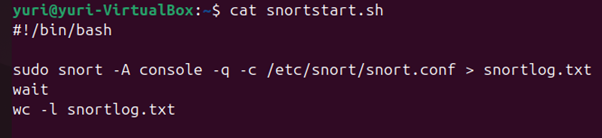

<h1>Snort local rule to detect slow-rate Hydra attacks</h1>
<!--
 ### [YouTube Demonstration]()
-->
<h2>Description</h2>
This project is the one that I presented as a final project for my degree in MSc Cyber Security. I created three virtual machine:
- Ubuntu as a target machine where I activated the SSH service and installed Snort
- A Kali machine as the attacker
- Another Kali machine to simulate legit attempt to login into the SSH to test false positive.
<br />


<h2>Languages and Utilities Used</h2>

- <b>OpenSSH 3.0.13</b>
- <b>Snort 2.9.20</b> 
- <b>Bash</b>
- <b>Hydra Brute Force</b> 
  
<h2>Environments Used </h2>

- <b>Oracle VM Virtual Box 7.0</b> 
- <b>Ubuntu 24.04 LTS</b>
- <b>Kali Linux 2023.1</b> 

<h2>Program walk-through:</h2>

<p align="center">
Work in progress <br/>
 

<br />

 <!--


 ```diff
- text in red
+ text in green
! text in orange
# text in gray
@@ text in purple (and bold)@@
```
--!>
